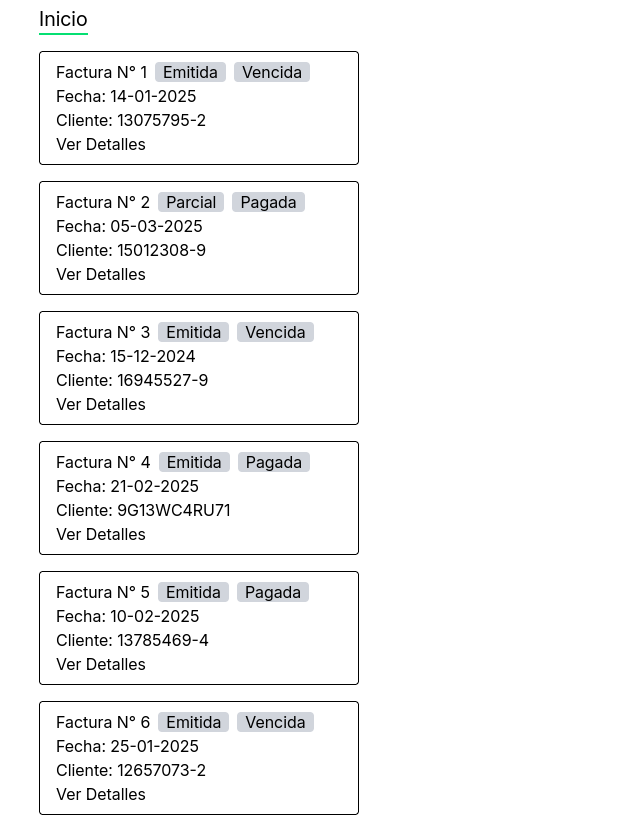
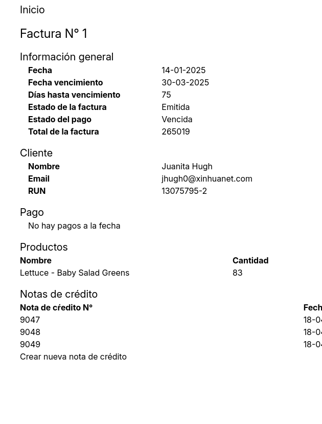
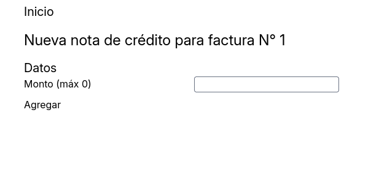

# Instalación

## Requisitos

Se debe instalar [dotnet 8](https://learn.microsoft.com/en-us/dotnet/core/install/), [dotnet ef](https://learn.microsoft.com/en-us/ef/core/cli/dotnet), python 3.13 (se recomienda el uso de [pyenv](https://github.com/pyenv/pyenv)) y [node 22](https://nodejs.org/en/download)

# Migraciones y seeds

## Migraciones

Para correr las migraciones, se debe navegar a la carpeta `backend`. Luego, se debe ejecutar el comando:

```sh
dotnet ef database update
```

## Seeds

Para agregar las seeds desde el json de configuración, se debe navegar a la carpeta `data_migration`. El script no requiere instalar más librerías que las built-in. Luego, se debe ejecutar el comando:

```sh
python migrate.py
```


# Backend

## Appsettings

La única configuración que podría necesitar ser modificada es el valor `FrontendUrl`. Este podría variar en diferentes computadores según el sistema operativo y puertos que esten disponibles. El valor por defecto de este es:

```json
{
    ...
    "FrontendUrl": "http://localhost:5173"
}

```

Este valor es necesario para configurar el CORS de la aplicación.

## Setup
Para instalar los requerimientos, se puede ejecutar el comando:

```sh
dotnet build
```
Este paso es opcional, ya que al correr el código se actualizan los paquetes automáticamente

## Ejecución
Para correr el código, se debe ejecutar el comando:

```sh
dotnet run
```

## Swagger
La documentación de los endpoints está disponible en estilo swagger. Para eso, correr el código y navegar a la [siguiente url](http://localhost:5171/swagger/index.html)

# Frontend

## Env

Antes de correr el código, se debe agregar la url del backend a las variables de entorno. Para esto, crear en la carpeta `frontend` un archivo llamado `.env` con los siguientes contenidos:

```env
VITE_BACKEND_URL=http://localhost:5171
```

Notar que los valores de la url de backend pueden variar dependiendo del puerto donde se haya posicionado la aplicación.

## Setup
Para instalar los requerimientos, se debe navegar a la carpeta `frontend`, y ejecutar el comando

```sh
npm install
```

## Ejecución
Para correr el código, se debe ejecutar el comando:

```sh
npm run dev
```

## Navegación

La aplicación parte en el menú de inicio, donde se despliegan todas las facturas.



El usuario puede presionar `Ver Detalles` en una factura para revisar los detalles de aquella factura:



Si se quiere ingresar una nueva nota de crédito, se puede hacer click en el botón titulado `Crear nueva nota de crédito`, que llevará a la pantalla de creación de nota de crédito. El formulario permite ingresar el monto de la nota de crédito y muestra el máximo monto que se puede ingresar antes de superar el total:



Finalmente, el usuario puede agregar la nota de crédito ingresando el valor en el campo y presionando `Agregar`.


# Patrones de diseño

Se incorporaron los siguientes patrones de diseño

## Builder
Este patrón está presente en el script de `data_migration`. La clase que lo implementa es `DataLoader`, en el archivo `data_migration/src/data_loader.py`, que corresponde a un constructor que a partir de un path de archivo genera las entidades a guardar en la base de datos. Se puede extender la interfaz de esta api para tener otras restricciones (por ejemplo, que no se descarten las facturas invalidas), o cambiar la representación en la que se guardan los objetos para así poder entrar en otros esquemas de bases de datos si los hubiera.

## Strategy
Se utilizan patrones strategy para validar los nuevos credit notes y las facturas, utilizando las interfaces `INewCreditNoteValidator` y `IInvoiceValidator`, en los archivos `backend/Tools/NewCreditNoteValidator.cs` y `backend/Tools/InvoiceValidator.cs` respectivamente.

# Suposiciones

* El credit_note_number es asignado automáticamente y no es ingresado por el usuario.